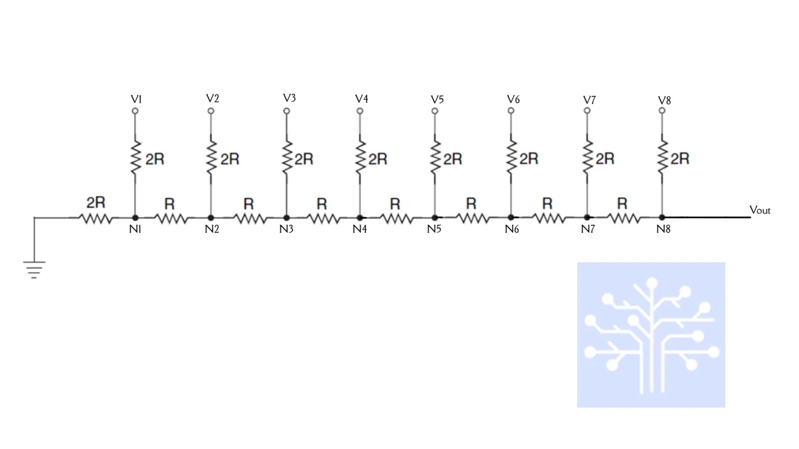

## How it works

This project implements a Direct Digital Synthesis (DDS) waveform generator. 

The core of the design is a **Phase Accumulator** that increases every clock cycle by a programmable frequency control word (`freq_word`). The output frequency follows the standard DDS formula:

$$f_{out} \approx \frac{freq\_word}{2^{16}} \cdot f_{clk}$$

The most significant bits (MSB) of the accumulator are used to generate five different waveforms:
* **Sine:** Generated via a 16-entry Lookup Table (LUT).
* **Sawtooth:** Derived directly from the phase value.
* **Square:** Generated by checking the MSB of the phase (50% duty cycle).
* **Triangle:** Created by bit-manipulation of the phase (inverted ramp).
* **Quadratic:** A parabolic curve generated by squaring the phase value.

The design is optimized for a **50 MHz** system clock and provides an 8-bit digital output.

---

## Control Table (ui_in[7:0])

The 8-bit input controls the generator's behavior:

| Bits | Function |
|:---:|:---:|
| [7:6] | Frequency Control |
| [5:3] | Amplitude Control |
| [2:0] | Waveform Selection |

---

### Waveform Selection (ui_in[2:0])

| Bits | Function |
|:---:|:---:|
| 000 | Sine |
| 001 | Sawtooth |
| 010 | Square |
| 011 | Triangle |
| 100 | Quadratic |

---

### Frequency Control (ui_in[7:6])

| Bits | freq_word (Dec) | Description |
|:---:|:---:|:---:|
| 00 | 128 | Low frequency |
| 01 | 512 | Medium-low |
| 10 | 1024 | Medium-high |
| 11 | 4096 | High frequency |

---

### Amplitude Control (ui_in[5:3])

| Bits | Level | Scaling Factor |
|:---:|:---:|:---:|
| 000 | Low | 12.5% |
| 001 | Medium-Low | 25% |
| 010 | Medium-High | 50% |
| 111 | Maximum | 100% |

---

## How to test

1. Apply a 50 MHz clock to `clk` and release reset (`rst_n = 1`).
2. Set `ui_in` to select your desired output (e.g., `8'b00_111_000` for a 100% Amplitude Sine Wave at low frequency).
3. Observe the 8-bit output `uo_out`.

### Simulation in Vivado
1. Run the behavioral simulation using the provided `test/tb.v`.
2. To view the signals exactly as shown in the documentation, open the pre-configured waveform file:
   `test/waveforms/main_waveform_config.wcfg`

## Simulation Results

The image below demonstrates the transitions between different waveforms and the impact of amplitude scaling.

*Note: The `uo_out` signal is displayed in 'Analog' style with 'Hold' interpolation for better visualization.*

---

## External Hardware

To visualize the generated waveforms on an oscilloscope, an external **Digital-to-Analog Converter (DAC)** is required.

### Recommended DAC Characteristics
* **Resolution:** 8-bit (to match `uo_out`).
* **Input:** Parallel digital input.
* **Voltage Range:** 0V to 3.3V.
* **Sample Rate:** Supports up to 50 MHz.

### Implementation Options

#### 1. R-2R Resistor Ladder (Recommended)
Building an R-2R ladder is the most direct way to convert the 8-bit parallel data.

> **Pro Tip:** Use 1% precision resistors to ensure the linearity of the analog steps and avoid "ghosting" or distortion in the signal.

#### 2. Dedicated DAC IC
For higher signal integrity, use a parallel-input DAC like the **DAC0808**. If using a serial DAC (SPI/I2C), external shift registers will be necessary to convert the parallel output.
